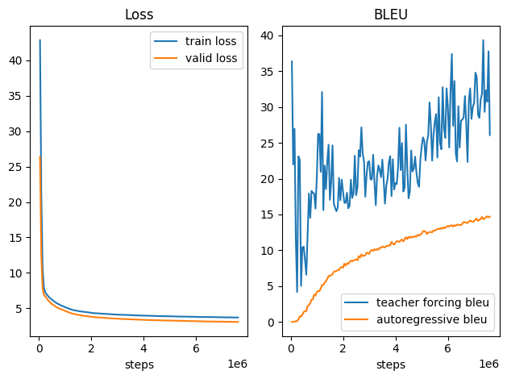
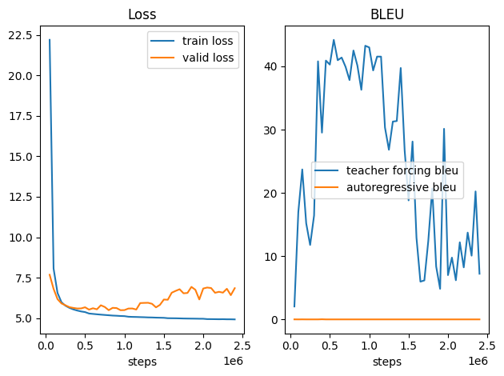

# pytorch-Transformer
用pytorch复现"Attention is all you need"中的Transformer(base)

## 数据集
WMT 2014 English-German dataset

## 文件
《train.py》是《transformer(draft).ipynb》的脚本

《log.txt》记录了《train.py》的输出

《Test.ipynb》用于对实验结果的绘图和预测

《Transformer实验过程.docx》记录了实验的整个过程（包括更新、debug、调参和分析）

《transformer(draft).ipynb》实现训练程序，同时在文件开头记录了每次对程序的更新

# 2023年4月29日更新
这个月太忙了，主要工作是在4月2日到4月18日完成的
* 修改了一些bug，换了句子对排序组batch的算法，较大地提升了GPU利用率
* 

# 2023年4月1日更新
这两周主要训练完3月6日的模型和探索超参数。

这是九个epoch之后的情况:

可以看出自回归的BLEU分数虽然一直上升，但离论文里的25.8还很远，而且训练步数快是原论文的两倍了(实际步数=总步数/梯度累积步数)

我认为是英德互译的原因，论文里是英译德。我一开始认为英德互译有益于单向翻译，但忽略了该互译任务需要更多的参数。
我把任务改为英译德，同时发现一些地方超参数不对，所以花了一段时间探索该任务的超参数（结果记录在《超参设置.xlsx》）

最后决定用最接近论文里的超参数设置。
由于显卡内存的原因，论文里有两个超参数不能重现，只能接近：
* 每个batch要包含25000个源Tokens和25000个目标tokens(用梯度累积可以做到接近的情况，但实际上每个batch包含的token数少于论文里的token数)
* 用完整序列训练(序列太长会爆显存，所以需要截断，最大长度设置为768)

第一点不会产生太大影响，但第二点的影响需要看有多少比例的序列被截断。

以下是截断长度设置为256时的训练情况：

可以看出过拟合了。

另一方面，我认为可以把英德互译看作预训练，最后在英译德任务上微调。但为了忠于论文，放在以后再探索。

训练最接近论文里的模型中...

# 2023年3月16日更新

除了完成TODO的七项内容外，还减小了输出log的频率，主要是抵消自回归预测太慢的影响。

##  正在训练第二轮

可以看出Teacher Forcing和自回归预测的gap还是很大的，这里更应该关注自回归的BLEU分数。
增加梯度累积机制，并在更新参数后让scheduler进行step，使学习率下降得没这么快了，且使valid loss下降更快了。（大概比之前快了14倍左右）

# 2023年3月11日上传
## 10轮训练结束
 

train loss更高应该是dropout在起作用

## 训练中发现的一些失误
1. 忘了pytorch的BLEU分数的值域是[0,1]，一直以为满分是100（论文的满分是100），以为模型还没训练好，其实早就可以停止训练了（虽然现在loss还在下降，但是BLEU分数一直在波动）。
2. 把德译英和英译德两个loss加起来再backward导致占用了一半的GPU内存(GPU利用率不到50%),应该算好其中一个loss就backward。
3. 每一批的源Token和目标Token的数量只有1050，远少于25000（原论文一批数据的Token数量），应该用梯度累积解决。
4. 同3，由于每一步的训练样本少了，所以会比原论文要更新更多步，导致学习率更新过快，第8个epoch时学习率已经1e-5了
5. 验证集不是用自回归去预测（预测的Token能看到前面的正确Token，但看不到自己预测的Token），准确率上升,连贯性下降。（暂时不知道对BLEU的影响）

## TODO(训练完第十个epoch后进行):
1. 把测试部分独立出来,放在另一个文件（完成）
2. 将BLEU乘以100（完成）
3. 根据valid的BLEU保存参数（完成）
4. 提前loss的backward（完成）
5. 增加梯度累积,并在更新参数后才让scheduler进行step。（完成）
6. 将验证集的评估改回自回归预测（完成）
7. 记录训练过程中BLEU的分数，并绘图（完成）
8. 增加英译德的评估和预测
