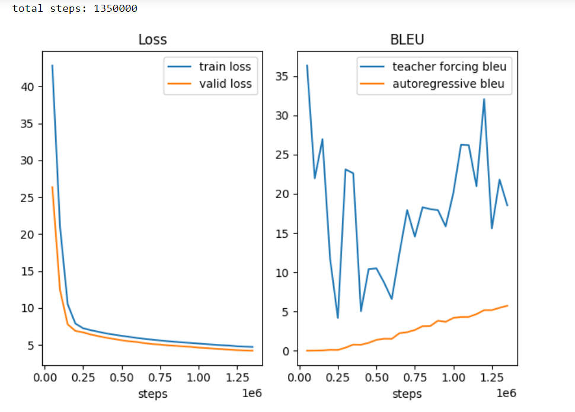

# pytorch-Transformer
用pytorch复现"Attention is all you need"中的Transformer(base)

## 数据集
WMT 2014 English-German dataset

## 文件
train.py是transformer(stable).ipynb的脚本

log.txt记录了train.py的输出

## 进度
目前仍在训练 

train loss更高应该是dropout在起作用

## 训练中发现的一些失误
1. 忘了pytorch的BLEU分数的值域是[0,1]，一直以为满分是100（论文的满分是100），以为模型还没训练好，其实早就可以停止训练了（虽然现在loss还在下降，但是BLEU分数一直在波动）。
2. 把德译英和英译德两个loss加起来再backward导致占用了一半的GPU内存(GPU利用率不到50%),应该算好其中一个loss就backward。
3. 每一批的源Token和目标Token的数量只有1050，远少于25000（原论文一批数据的Token数量），应该用梯度累积解决。
4. 同3，由于每一步的训练样本少了，所以会比原论文要更新更多步，导致学习率更新过快，第8个epoch时学习率已经1e-5了
5. 验证集不是用自回归去预测（预测的Token能看到前面的正确Token，但看不到自己预测的Token），准确率上升,连贯性下降。（暂时不知道对BLEU的影响）

## TODO(训练完第十个epoch后进行):
1. 把测试部分独立出来,放在另一个文件
2. 将BLEU乘以100
3. 根据valid的BLEU保存参数
4. 提前loss的backward
5. 增加梯度累积,并在更新参数后才让scheduler进行step。(暂时先改为以1e-3的学习率训练接下来的epoch)
6. 将验证集的评估改回自回归预测
7. 记录训练过程中BLEU的分数，并绘图
8. 增加英译德的评估和预测
